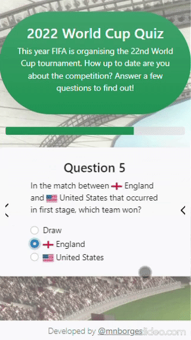

<!--
Hey, thanks for using the awesome-readme-template template.
If you have any enhancements, then fork this project and create a pull request
or just open an issue with the label "enhancement".

Don't forget to give this project a star for additional support ;)
Maybe you can mention me or this repo in the acknowledgements too
-->
<div align="center">

  <h1>2022 World Cup Quiz</h1>
  
  <p>
    A fun trivia to test how well-informed you are about the World Cup events.
  </p>
  
  
<!-- Badges -->
<p>
  <a href="https://github.com/mnborges/wcquiz/graphs/contributors">
    
  </a>
  <a href="">
    
  </a>
  <a href="https://github.com/mnborges/wcquiz/issues/">
    
  </a>
</p>
   
<h4>
    <a href="https://github.com/mnborges/wcquiz">Documentation</a>
  <span> · </span>
    <a href="https://github.com/mnborges/wcquiz/issues/">Report Bug</a>
  <span> · </span>
    <a href="https://github.com/mnborges/wcquiz/issues/">Request Feature</a>
  </h4>
</div>

<br />

<!-- Table of Contents -->

# :notebook_with_decorative_cover: Table of Contents

-   [About the Project](#star2-about-the-project)
    -   [Screenshots](#camera-screenshots)
    -   [Tech Stack](#space_invader-tech-stack)
    -   [Environment Variables](#key-environment-variables)
-   [Getting Started](#toolbox-getting-started)
    -   [Prerequisites](#bangbang-prerequisites)
    -   [Run Locally](#running-run-locally)
-   [Contact](#handshake-contact)
-   [Acknowledgements](#gem-acknowledgements)

<!-- About the Project -->

## :star2: About the Project

This project was developed with the goal to study and pratice the usage of the Laravel Framework, thus it has low complexity and a single feature: send questions to the client and grade their submitted answers.

Despite the app's simplicity, it is still a fun trivia to play and interact with.

<!-- Screenshots -->

### :camera: Screenshots

<div align="center"> 
  
</div>

<!-- TechStack -->

### :space_invader: Tech Stack

  <ul>
    <li><a href="https://laravel.com/">Laravel</a></li>
    <li><a href="https://www.php.net/">PHP</a></li>
    <li><a href="https://tc39.es/ecma262/">JavaScript</a></li>
    <li><a href="https://getbootstrap.com/">Bootstrap</a></li>
    <li><a href="https://www.mysql.com/">MySQL</a></li>
    <li><a href="https://www.docker.com/">Docker</a></li>
  </ul>

<!-- Env Variables -->

### :key: Environment Variables

To run this project, you will need to define the variables in the [.env.example](.env.example) file to your local environment variables in the .env file.

<!-- Getting Started -->

## :toolbox: Getting Started

<!-- Prerequisites -->

### :bangbang: Prerequisites

Use Laravel's built-in interface solution, [Sail](https://github.com/laravel/sail), to run the project using [Docker](https://docker.com). To get started [Docker Desktop](https://www.docker.com/products/docker-desktop) should be installed in your machine. Plus, if you use Windows, Windows Subsystem for Linux 2 (WSL2) must be installed and enabled. For more information view [Laravel documention](https://laravel.com/docs/9.x#laravel-and-docker).

<!-- Run Locally -->

### :running: Run Locally

Clone the project

```bash
  git clone https://github.com/mnborges/wcquiz.git
```

Go to the project directory

```bash
  cd wcquiz
```

Create and start Docker containers

```bash
  ./vendor/bin/sail up
```

Migrate and seed the Database

```bash
  ./vendor/bin/sail php artisan migrate:fresh --seed
```

Go to [localhost](localhost) in your web browser to check out the application

To stop all containers you can press Control + C in the terminal or use the stop command

```bash
  ./vendor/bin/sail stop
```

<!-- Contact -->

## :handshake: Contact

Maieza N. Borges - [LinkedIn](https://www.linkedin.com/in/maieza-borges-903895b8/) - maieza.borges@gmail.com

<!-- Acknowledgments -->

## :gem: Acknowledgements

I would like to acknowledge some projects that were valuable to the development of this app:

-   [Awesome README](https://github.com/matiassingers/awesome-readme) for the template of this page.
-   [World Cup JSON](https://github.com/estiens/world_cup_json) for the amazing World Cup API used to seed the DB for the app's questions.
